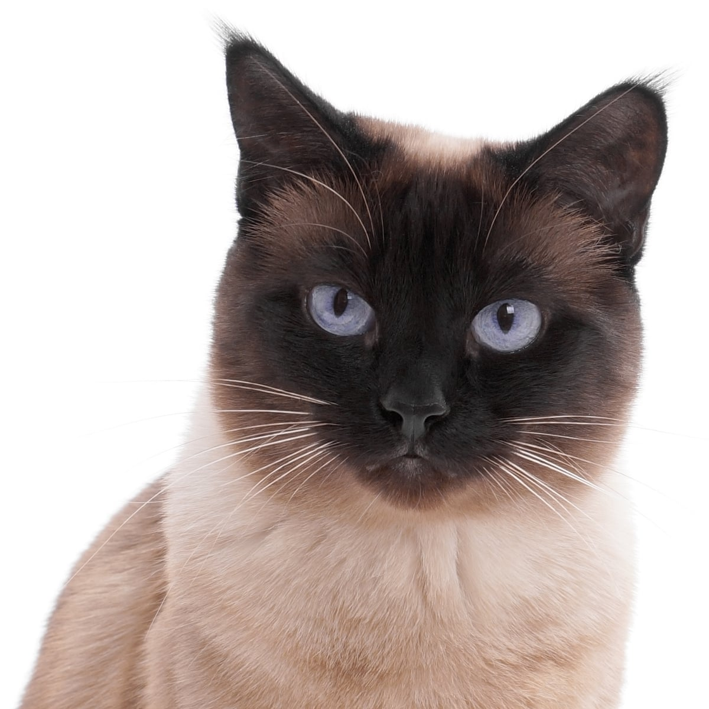

# Cat Face Cropper

Cropping lovely cat 🐈 faces automatically ❤️ with python3 and openCV

## How to use

```
python3 main.py [import_folder] [export_folder] [width] [height]
```

### Input




### Output


## Limitation

`catface_detector.xml` by Joseph Howse, doesn't work correctly with some cat pictures...
We need more accurate machine learning model for cat faces.